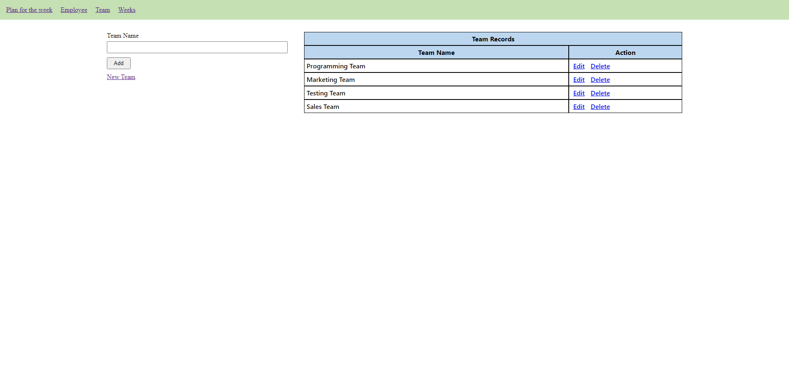
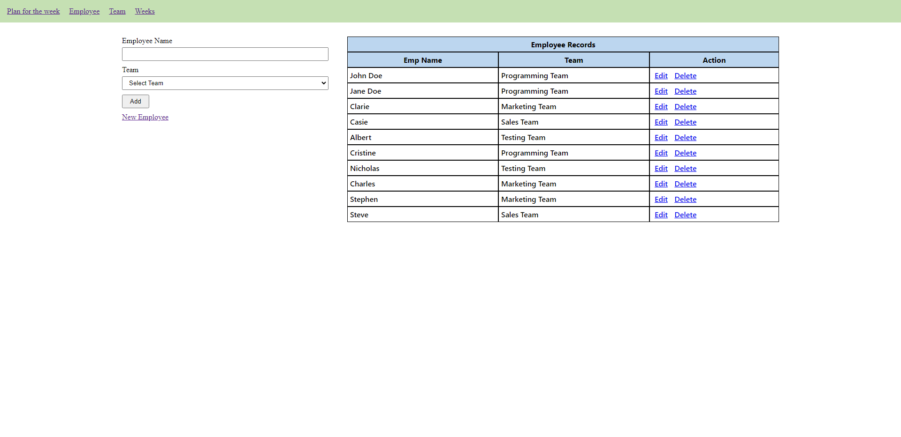
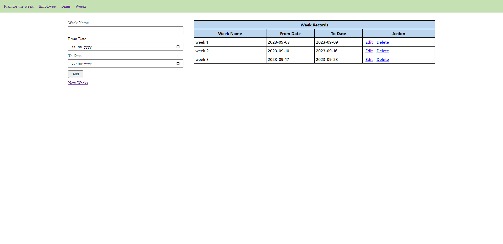
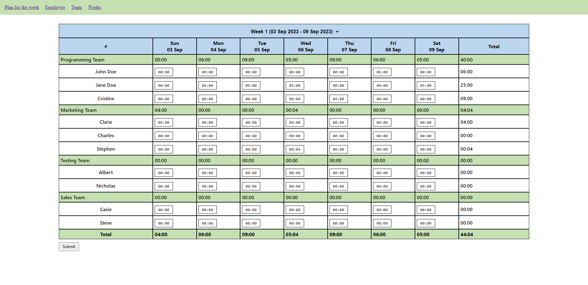

# Weekly Pre Scheduling

---

## Overview

“Weekly Pre Scheduling” is the task of planning / monitoring the resources, based on time allocated for a particular individual or a particular Team in a week.

### Files
###### [Weeks](./weeks.php)
###### [Teams](./team.php)
###### [Employee](./employee.php)
###### [Plan For The Week](./index.php)

###### [Header Nav](inc/header.inc.php) `Nav Menu`

###### [Stylesheet](./style.css) `style file`
---
### Folder
- storage
- inc
- classes

## Stack
- Using In memory Inbuilt Database
###### [In Memory](classes/inmemory.class.php) `Inmemory Database`

---
## Screenshots

---
## Built With

- [HTML](#!)
- [CSS](#!)
- [PHP](#!)

---
## Contact

- [Website](https://www.vetrisuriya.in/)
- [GitHub](https://github.com/vetrisuriya)
- [Codepen](https://codepen.io/vetrisuriya)
- [Linkedin](https://www.linkedin.com/in/vetrisuriya/)